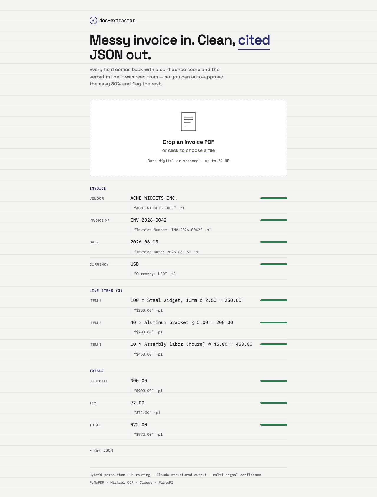

# doc-extractor

**Turn messy invoices into clean, validated JSON — with a confidence score and a source citation for every field.**

[](https://doc-extractor-five.vercel.app)
[](https://www.python.org)
[](LICENSE)

Upload an invoice PDF and get back structured data — vendor, dates, line items, totals — that matches a fixed schema, where **every field carries its own `confidence`, `source_quote`, and `page`**. Auto-approve the easy 80%; route the uncertain 20% to a human.



> **Live demo → https://doc-extractor-five.vercel.app** — drop an invoice PDF, watch it come back as a ledger of cited, confidence-scored fields.

---

## What it does

- **Born-digital *and* scanned PDFs** — a router sends clean text-layer docs down a cheap native-text path (PyMuPDF) and scanned docs through OCR (Mistral) to Markdown + page image.
- **Schema-validated output** — Claude's Structured Outputs constrain decoding to a fixed Pydantic invoice schema, so the JSON is *guaranteed* valid, not regex-scraped.
- **A confidence score + source citation per field** — every value comes back as `{value, confidence, source_quote, page, review_required}`, so you can see *why* to trust it.
- **Business-rule validation** — line items sum to subtotal, subtotal + tax = total, dates normalize to ISO, amounts ≥ 0.

---

## How it works

Async extraction pipeline — `POST /extract` returns a `job_id` immediately; the client polls `GET /jobs/{id}` to completion.

```
Upload (PDF/img)
      │   FastAPI  POST /extract  (returns job_id; async)
      ▼
[1] INGEST         type/size check · page count · create job
      ▼
[2] ROUTE + PARSE  native-text? → fast path (PyMuPDF)
                   scanned/complex? → OCR to Markdown (Mistral OCR)
                   keep page image alongside Markdown
      ▼
[3] EXTRACT (LLM)  Claude + JSON Schema (Structured Outputs)
                   input = Markdown + page image
                   default model Haiku 4.5 → escalate on low confidence
                   return fields + per-field source quote + page
      ▼
[4] VALIDATE       Pydantic (types/enums) + business rules
                   (line items Σ == total, dates, amounts)
                   multi-signal confidence per field
      ├── pass & high-confidence ─► OUTPUT  JSON
      └── fail or low-confidence ─► flagged review_required
```

---

## The interesting engineering (2026 choices)

This is what separates it from a 2023-era "throw the PDF at a vision model" tutorial:

- **Hybrid parse-then-LLM routing** (`app/route.py`, `app/parse.py`) — born-digital PDFs use the native text layer (~10–20× cheaper than page images); scanned docs OCR to Markdown, then go to the LLM as **Markdown + image**. Vision is the last resort, not the default.
- **Claude Structured Outputs / constrained decoding** (`app/schema.py`, `app/extract.py`) — one Pydantic model is the single source of truth: it derives the strict JSON Schema fed to Claude, the API response shape, and the validation types. No parsing model output.
- **Multi-signal confidence** (`app/confidence.py`) — not "ask the model how sure it is." Blends *passes-validation* + *value-found-verbatim-in-source* + *self-consistency across N samples* into one per-field score, thresholded to `review_required`.
- **Prompt caching** (`app/extract.py`) — the stable schema + instructions prefix is cached (`cache_control: ephemeral`) → ~90% cost cut on the fixed prompt across many docs.
- **Bounded model cascade** — default **Haiku 4.5**, escalate to **Sonnet 5** then **Opus 4.8** only when a critical field comes back low-confidence. No loops.
- **Self-cite provenance** — `source_quote` + `page` live in the schema, so citations come back in the same single structured-output call (Claude's native Citations and Structured Outputs can't be combined in one call).

---

## Accuracy

Field-level precision / recall / F1, measured over **48 of 50** labeled eval invoices (30 clean-native, 10 scanned, 10 edge; 2 excluded — their 40-line-item output exceeds the model's `max_tokens` cap and fails safe rather than returning truncated JSON). Values normalized before comparison (dates→ISO, amounts→decimal). Full report: [`eval/report.md`](eval/report.md).

| Field | Precision | Recall | F1 | n |
|---|---|---|---|---|
| vendor_name | 1.00 | 1.00 | 1.00 | 48 |
| invoice_number | 1.00 | 1.00 | 1.00 | 47 |
| invoice_date | 1.00 | 1.00 | 1.00 | 47 |
| currency | 1.00 | 1.00 | 1.00 | 48 |
| subtotal | 0.93 | 0.90 | 0.91 | 48 |
| tax | 0.93 | 0.89 | 0.91 | 46 |
| total | 0.93 | 0.90 | 0.91 | 48 |
| line_items.description | 1.00 | 1.00 | 1.00 | 116 |
| line_items.quantity | 1.00 | 1.00 | 1.00 | 116 |
| line_items.unit_price | 0.95 | 0.91 | 0.93 | 116 |
| line_items.amount | 0.95 | 0.91 | 0.93 | 116 |

**Straight-through processing (STP): 90%** — 43/48 docs extracted with zero fields needing a human edit (100% STP on clean-native; 50% scanned; 80% edge). Measured at `N_SAMPLES=1`. Regression-guarded in CI on every push (`eval/test_golden.py`).

---

## Quickstart

Runs from a clean clone. Requires Python 3.12 and an [Anthropic API key](https://console.anthropic.com/) (plus a [Mistral key](https://console.mistral.ai/) for the scanned-doc OCR path).

```bash
git clone https://github.com/Scylla23/doc-extractor.git
cd doc-extractor

python3.12 -m venv .venv && source .venv/bin/activate
pip install -r requirements.txt

cp .env.example .env      # then paste your keys into .env:
#   ANTHROPIC_API_KEY=sk-ant-...
#   MISTRAL_API_KEY=...

# 1) Extract one invoice straight from the CLI:
python -m app.extract samples/sample1.pdf

# 2) Or run the API:
uvicorn app.main:app --reload        # http://localhost:8000/docs
curl -F file=@samples/sample1.pdf http://localhost:8000/extract
#   -> {"job_id": "...", "status": "queued"}   (poll GET /jobs/{job_id})
```

**Run the UI locally too:** point it at your local API by setting
`window.API_BASE = "http://localhost:8000"` in [`web/config.js`](web/config.js), then serve `web/`:

```bash
python -m http.server 5173 -d web    # http://localhost:5173
```

Or just use the [hosted demo](https://doc-extractor-five.vercel.app) — no setup.

---

## Tech stack

| Layer | Choice |
|---|---|
| API | FastAPI (async, auto OpenAPI docs) |
| Worker | FastAPI `BackgroundTasks` + in-memory job store |
| Parse / OCR | PyMuPDF (native fast path) + Mistral OCR (scans) |
| Extraction LLM | Claude — Haiku 4.5 → Sonnet 5 → Opus 4.8 cascade |
| Structured output | Claude Structured Outputs + Instructor + Pydantic |
| UI | Static HTML + vanilla JS |
| Deploy | Railway (API) + Vercel (UI), auto-deploy on push |
| Eval | Labeled golden set scored in CI |

---

## Roadmap

MVP is invoices-only, deployed live. Next (see `tasks.md` Backlog):

- Persistent storage (Supabase) to replace the in-memory job store → horizontal scale.
- Human-in-the-loop review UI (doc image + bbox highlight, one-click correct; corrections feed the eval set).
- More document types (receipts, resumes, bank statements) via pluggable schemas.
- Batch API (−50%) for bulk backfills; two-pass citations for regulated/high-stakes provenance.
- Security/compliance pack (ZDR, PII redaction, retention/delete endpoint, audit log).

---

## License

[MIT](LICENSE) © 2026 Pavan Kushnure
